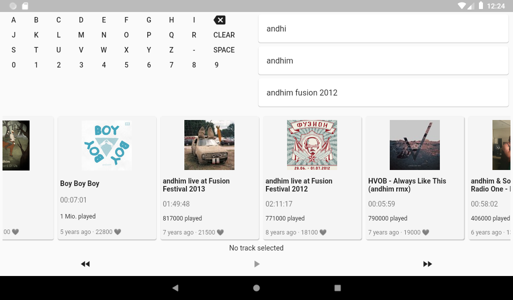

# 🔊☁️ 🔥📺  Sound on Fire 

A Flutter based Soundcloud App for your Fire TV.

## Currently under development!

The current implementation looks like this:

### Features planned:

- Comprehensive Footer (Current Track, Play/Pause, etc.)
- In-App Update
- Add App Icon and Splash-Screen
- Install Guide in README
- Implementation of FireTV Hardkeys (Play/Pause, Previous, Forward)

## Contribution

PRs Welcome!