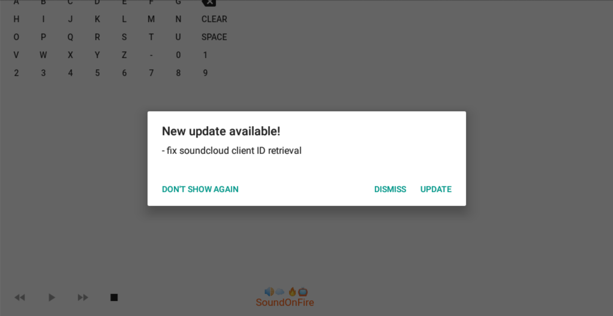

<p align="center">
    
</p>

# 🔊☁️ 🔥📺  SoundOnFire 


<a href="https://github.com/timoknapp/sound-on-fire/releases"></a> <!-- PRE-RElEASE -->
<a href="https://github.com/timoknapp/sound-on-fire/releases"></a>
<a href="https://github.com/timoknapp/sound-on-fire/graphs/contributors"></a>
<!-- <a href="https://github.com/timoknapp/sound-on-fire/releases"></a> --> <!-- RElEASE -->

A Flutter based SoundCloud App for your Fire TV.


## Getting Started

In order to get started with **SoundOnFire** on your FireTV, you need to do the following:
- Download the latest Release from one of those: 
    - [GitHub](https://github.com/timoknapp/sound-on-fire/releases) 
    - [Microsoft App-Center](https://install.appcenter.ms/users/timo_knapp/apps/soundonfire/distribution_groups/public)
- Install the `.apk` on your FireTV
    - with your Android Smartphone using this [App](https://play.google.com/store/apps/details?id=mobi.koni.appstofiretv&hl=en)
    - with your computer or another FireTV App [reade here](https://www.howtogeek.com/336602/how-to-sideload-apps-on-the-fire-tv-and-fire-tv-stick/)
- Once the **SoundOnFire** App has been installed on your FireTV, it will directly pop up on the bottom right of your screen. Otherwhise you will find it under: `Home > Your Apps > All Apps > SoundOnFire`

## In-App Update

When the App starts, it will automatically check for new releases of SoundOnFire and will notify you in case there is an update availabe. You will then have three option: *Don't show again*, *Dismiss* or *Update* (recommended)



## Roadmap

This is currently the roadmap, please feel free to request additions/changes.

| Feature                                                      | Progress |
| :----------------------------------------------------------- | :------: |
| Stop playing when App crashes/closes/pauses                  |    ✅    |
| FireTV remote hardkey support (Play/Pause, Rewind, Forward)  |    ✅    |
| Playlist mode (Continue playing, when track finished)        |    ✅    |
| Screensaver disabled when playing                            |    ✅    |
| Comprehensive Footer (Current Track, Play/Pause, etc.)       |    ✅    |
| In-App Update                                                |    ✅    |
| Autofetch search results                                     |    ✅    |
| Smartphone as Remote (Paring via QR)                         |    🔜    |
| Store favorites locally                                      |    🔜    |
| Use Slider to scroll through track                           |    🔜    |
| Build Version for AppleTV and MacOS                          |    🔜    |

## Known Issues

- **BUG**: Tracks longer than ~ 40 minutes will stop unexpectedly and next track continues. Its a known issue and it seems to relate to an unexpected connection loss to the stream. The logs show the following error:
    - `W/MediaHTTPConnection( 3979): readAt 36823797 / 7435 => java.net.ProtocolException: unexpected end of stream`

## Contribution

PRs Welcome!

## Privacy

Read [here](PRIVACY.md)

<!-- ### Setup Version Bump as git-hook

```
# in project dir
cp .github/scripts/pre-commit.sh .git/hooks/pre-commit && chmod +x .git/hooks/pre-commit
``` -->
