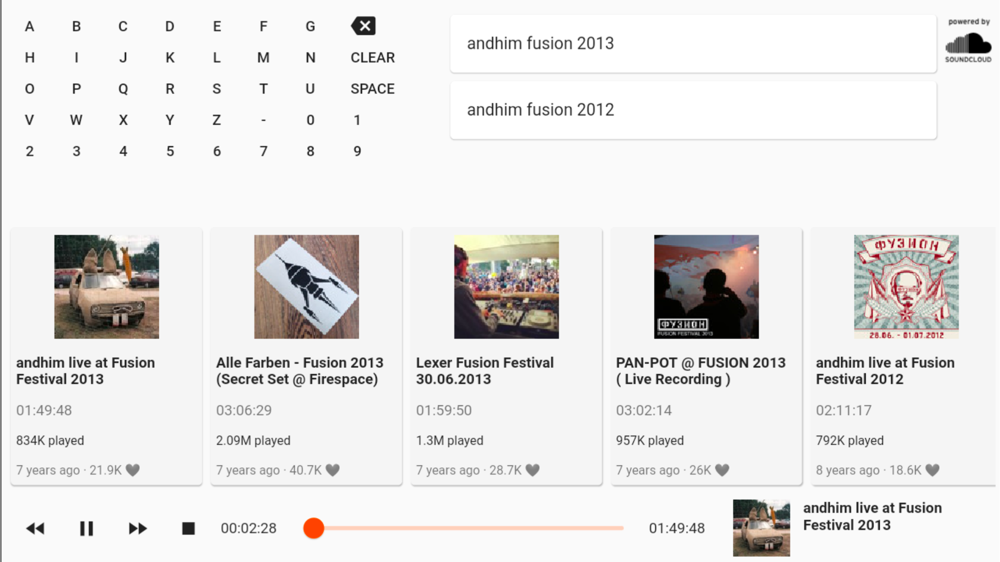

# 🔊☁️ 🔥📺  SoundOnFire 


<a href="https://github.com/tea-mo903/sound-on-fire/releases"></a> <!-- PRE-RElEASE -->
<a href="https://github.com/tea-mo903/sound-on-fire/releases"></a>
<a href="https://github.com/tea-mo903/sound-on-fire/graphs/contributors"></a>
<!-- <a href="https://github.com/tea-mo903/sound-on-fire/releases"></a> --> <!-- RElEASE -->

A Flutter based SoundCloud App for your Fire TV.

## 🚧 Work in progress



## Getting Started

In order to get started with **SoundOnFire** on your FireTV, you need to do the following:
- Download the latest Release from one of those: 
    - [GitHub](https://github.com/tea-mo903/sound-on-fire/releases) 
    - [Microsoft App-Center](https://install.appcenter.ms/users/timo_knapp/apps/soundonfire/distribution_groups/public)
- Install the `.apk` on your FireTV
    - with you Android Smartphone using this [App](https://play.google.com/store/apps/details?id=mobi.koni.appstofiretv&hl=en)
    - with your computer or another FireTV App [reade here](https://www.howtogeek.com/336602/how-to-sideload-apps-on-the-fire-tv-and-fire-tv-stick/)
- Once the **SoundOnFire** App has been installed on your FireTV, it will directly pop up on the bottom right of your screen. Otherwhise you will find it under: `Home > Your Apps > All Apps > SoundOnFire`

## Features planned

- 🚧 In-App Update
- FireTV Hardkeys (Play/Pause, Previous, Forward)
- Fetch more search results while scrolling
- Use Slider to scroll through track
- Store favorite tracks locally
- ✔️ Continue playing, when track finished (Playlist)
- ✔️ Comprehensive Footer (Current Track, Play/Pause, etc.)
- ✔️ Disable Screensaver
- ✔️ App Icon
- ✔️ Installation Guide in `README.MD`

## Known Issues

- **BUG:** When track ends in Playlist, sometimes an error occurs related to the bottom-bar slider:
    - `'package:flutter/src/material/slider.dart': Failed assertion: line 132 pos 15: 'value >= min && value <= max': is not true.`
- ✔️ **BUG:** Play Song > Pause > Stop: breaks the focus on FireTV 
- ✔️ **BUG:** When playing has ended, its still showing `pause` icon


## Contribution

PRs Welcome!

### Setup Version Bump as git-hook

```
# in project dir
cp .github/scripts/pre-commit.sh .git/hooks/pre-commit && chmod +x .git/hooks/pre-commit
```
