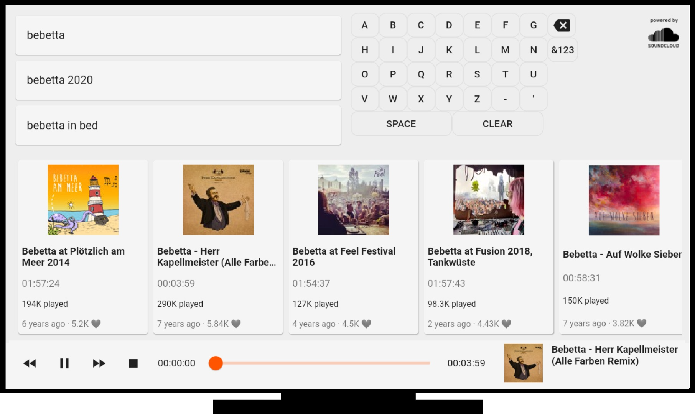

<p align="center">
    
</p>

# 🔊☁️ 🔥📺  SoundOnFire 


<a href="https://github.com/timoknapp/sound-on-fire/releases"></a> <!-- PRE-RElEASE -->
<a href="https://github.com/timoknapp/sound-on-fire/releases"></a>
<a href="https://github.com/timoknapp/sound-on-fire/graphs/contributors"></a>
<!-- <a href="https://github.com/timoknapp/sound-on-fire/releases"></a> --> <!-- RElEASE -->

A Flutter based SoundCloud App for your Fire TV.



## Getting Started

In order to get started with **SoundOnFire** on your FireTV, you need to do the following:
- Download the latest Release from one of those: 
    - [GitHub](https://github.com/timoknapp/sound-on-fire/releases) 
    - [Microsoft App-Center](https://install.appcenter.ms/users/timo_knapp/apps/soundonfire/distribution_groups/public)
- Install the `.apk` on your FireTV
    - with you Android Smartphone using this [App](https://play.google.com/store/apps/details?id=mobi.koni.appstofiretv&hl=en)
    - with your computer or another FireTV App [reade here](https://www.howtogeek.com/336602/how-to-sideload-apps-on-the-fire-tv-and-fire-tv-stick/)
- Once the **SoundOnFire** App has been installed on your FireTV, it will directly pop up on the bottom right of your screen. Otherwhise you will find it under: `Home > Your Apps > All Apps > SoundOnFire`

## In-App Update

When the App startes, it will automatically check for new releases of SoundOnFire and will notify you if there is an update availabe. You will then have three option: Don't show again, Dismiss or **Update** (recommended)


## Roadmap

This is currently the roadmap, please feel free to request additions/changes.

| Feature                                                      | Progress |
| :----------------------------------------------------------- | :------: |
| Stop playing when App crashes/closes/pauses                  |    ✅    |
| FireTV remote hardkey support (Play/Pause, Rewind, Forward)  |    ✅    |
| Playlist mode (Continue playing, when track finished)        |    ✅    |
| Screensaver disabled when playing                            |    ✅    |
| Comprehensive Footer (Current Track, Play/Pause, etc.)       |    ✅    |
| In-App Update                                                |    ✅    |
| Autofetch search results                                     |    ✅    |
| Smartphone as Remote (Paring via QR)                         |    🔜    |
| Store favorites locally                                      |    🔜    |
| Use Slider to scroll through track                           |    🔜    |

## Known Issues

- ~~**BUG**: When track ends in Playlist, sometimes an error occurs related to the bottom-bar slider:~~
    - ~~`'package:flutter/src/material/slider.dart': Failed assertion: line 132 pos 15: 'value >= min && value <= max': is not true.`~~

## Contribution

PRs Welcome!

## Setting up dev

Easiest way to setup your development environment is simply opening the project in VScode (Dart and Flutter extensions too). You will also need to download Flutter's SDK and add it to your PATH, you can do so in the following [link](https://flutter.dev/docs/get-started/install)
.

 After the installation process, you will need to set up a device or emulator; Follow the instructions in the following links depending on your choose.

- [iOS](https://flutter.dev/docs/get-started/install)
- [android](https://flutter.dev/docs/get-started/install/macos#android-setup)

If you already have an emulator or device recogniced by VSCode, then you just need to launch the app by going to `main.dart` and pressing `F5`.

### Troubleshouting 

- Running `flutter doctor` might hint you some issues with missing dependencies. Such as:

```
[✗] Android toolchain - develop for Android devices
    ✗ Unable to locate Android SDK.
      Install Android Studio from: https://developer.android.com/studio/index.html
      On first launch it will assist you in installing the Android SDK components.
      (or visit https://flutter.dev/docs/get-started/install/macos#android-setup for detailed instructions).
      If the Android SDK has been installed to a custom location, please use
      `flutter config --android-sdk` to update to that location.
```

- If running `flutter create .` fails; check the folder project name and make it compliant with Dart [rules](https://dart.dev/tools/pub/pubspec#name) .


## Privacy

Read [here](PRIVACY.md)

<!-- ### Setup Version Bump as git-hook

```
# in project dir
cp .github/scripts/pre-commit.sh .git/hooks/pre-commit && chmod +x .git/hooks/pre-commit
``` -->
